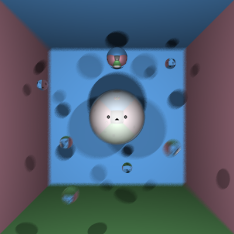

# Ray Tracer

##### Stage 1

- [x] Stage 1.1 - Familiarise yourself with the template
- [x] Stage 1.2 - Implement vector mathematics
- [x] Stage 1.3 - Fire a ray for each pixel
- [x] Stage 1.4 - Calculate ray-entity intersections
- [x] Stage 1.5 - Output primitives as solid colours

##### Stage 2

- [x] Stage 2.1 - Diffuse materials
- [x] Stage 2.2 - Shadow rays
- [x] Stage 2.3 - Reflective materials
- [x] Stage 2.4 - Refractive materials
- [x] Stage 2.5 - The Fresnel effect
- [x] Stage 2.6 - Anti-aliasing

##### Stage 3

- [ ] Option A - Emissive materials
- [ ] Option B - Ambient lighting/occlusion
- [ ] Option C - OBJ models
- [x] Option D - Glossy materials
- [ ] Option E - Custom camera orientation
- [ ] Option F - Beer's law
- [x] Option G - Depth of field

  3.D: The effect of glossy materials is done by extending reflective materials to consider its own colour as well as react to shadows and light similar to that of a diffuse material.

  3.G Depth of field is done by first calculating a focal point using the focal length to find the points that are in focus. Points that are not in focus are then blured. This is done by shifting the ray origin of those rays randomly with in the apreture radius and firing new rays with the new shifted origin. (Both focal length and aperture radius are measued in the same unit as the scene)

## Final scene render

Be sure to replace `./images/final_scene.png` with your final render so it shows up here:



This render took **9** minutes and **51** seconds on my PC.

I used the following command to render the image exactly as shown:

```
dotnet run -- -f tests/final_scene.txt -o images/final_scene.png --focal-length 1.9 --aperture-radius 0.05 -x 10
```

## Sample outputs

We have provided you with some sample tests located at `/tests/*`. So you have some point of comparison, here are the outputs our ray tracer solution produces for given command line inputs (for the first two stages, left and right respectively):

###### Sample 1

```
dotnet run -- -f tests/sample_scene_1.txt -o images/sample_scene_1.png -x 4
```

<p float="left">
  
   
</p>

###### Sample 2

```
dotnet run -- -f tests/sample_scene_2.txt -o images/sample_scene_2.png -x 4
```

<p float="left">
  
   
</p>

## References

Working through a ray tracer, from the head of the xbox games studio: https://www.linkedin.com/pulse/writing-simple-ray-tracer-c-matt-booty/

_Ray Tracing in a Weekend_: https://raytracing.github.io/

Great walkthrough of some of the basic maths: https://blog.scottlogic.com/2020/03/10/raytracer-how-to.html

Scratchapixel: intro to ray tracing: https://www.scratchapixel.com/lessons/3d-basic-rendering/introduction-to-ray-tracing/how-does-it-work

1000 Forms of Bunnies - Raytracing: https://viclw17.github.io/tag/#/Raytracing/

## Grading Report

8:36:54 PM: Building project C:\Users\Alex\Documents\GitHub\Project-1-Auto-Test\projects\XRAYRAY22  
8:36:56 PM: STDOUT:

Microsoft (R) Build Engine version 16.10.2+857e5a733 for .NET
Copyright (C) Microsoft Corporation. All rights reserved.

Determining projects to restore...
Restored C:\Users\Alex\Documents\GitHub\Project-1-Auto-Test\projects\XRAYRAY22\RayTracer.csproj (in 137 ms).
RayTracer -> C:\Users\Alex\Documents\GitHub\Project-1-Auto-Test\projects\XRAYRAY22\report\bin\RayTracer.dll

Build succeeded.
0 Warning(s)
0 Error(s)

Time Elapsed 00:00:01.01  
8:36:56 PM: Success building project.

### Stage 1

8:36:56 PM: Running test: 1*1_camera @ tests\Stage_1\1_1_camera~30s~-w_400*-h_300.txt  
8:36:56 PM: Iteration timeout: 30 seconds  
8:36:56 PM: Additional args: -w 400 -h 300  
8:36:56 PM: Render completed in **0.53 seconds** user processor time (raw = 0.53s).

<p float="left">


</p>

8:36:56 PM: Running test: 1_2_primitives @ tests\Stage_1\1_2_primitives~30s.txt  
8:36:56 PM: Iteration timeout: 30 seconds  
8:36:56 PM: Additional args: none  
8:36:57 PM: Render completed in **0.61 seconds** user processor time (raw = 0.61s).

<p float="left">


</p>

8:36:57 PM: Running test: 1_3_depth @ tests\Stage_1\1_3_depth~30s.txt  
8:36:57 PM: Iteration timeout: 30 seconds  
8:36:57 PM: Additional args: none  
8:36:58 PM: Render completed in **0.41 seconds** user processor time (raw = 0.41s).

<p float="left">


</p>

---

### Stage 2

8:36:58 PM: Running test: 2_1_diffuse @ tests\Stage_2\2_1_diffuse~60s.txt  
8:36:58 PM: Iteration timeout: 60 seconds  
8:36:58 PM: Additional args: none  
8:36:58 PM: Render completed in **0.64 seconds** user processor time (raw = 0.64s).

<p float="left">


</p>

8:36:58 PM: Running test: 2_2_reflection @ tests\Stage_2\2_2_reflection~60s.txt  
8:36:58 PM: Iteration timeout: 60 seconds  
8:36:58 PM: Additional args: none  
8:36:59 PM: Render completed in **0.63 seconds** user processor time (raw = 0.63s).

<p float="left">


</p>

8:36:59 PM: Running test: 2_3_refraction @ tests\Stage_2\2_3_refraction~300s.txt  
8:36:59 PM: Iteration timeout: 300 seconds  
8:36:59 PM: Additional args: none  
8:37:01 PM: Render completed in **2.36 seconds** user processor time (raw = 2.36s).

<p float="left">


</p>

8:37:01 PM: Running test: 2_4_sample @ tests\Stage_2\2_4_sample~300s~-x_3.txt  
8:37:01 PM: Iteration timeout: 300 seconds  
8:37:01 PM: Additional args: -x 3  
8:37:10 PM: Render completed in **8.33 seconds** user processor time (raw = 8.33s).

<p float="left">


</p>

---

### Stage 3D

8:37:15 PM: Running test: 3D_1_glossy @ tests\Stage_3D\3D_1_glossy~1800s.txt  
8:37:15 PM: Iteration timeout: 1800 seconds  
8:37:15 PM: Additional args: none  
8:37:16 PM: Render completed in **0.94 seconds** user processor time (raw = 0.94s).

<p float="left">


</p>

---

### Stage 3G

8:37:21 PM: Running test: 3G*1_dof @ tests\Stage_3G\3G_1_dof~1800s~--aperture-radius_0.06*--focal-length_1.5.txt  
8:37:21 PM: Iteration timeout: 1800 seconds  
8:37:21 PM: Additional args: --aperture-radius 0.06 --focal-length 1.5  
8:37:22 PM: Render completed in **0.81 seconds** user processor time (raw = 0.81s).

<p float="left">


</p>

---

### Stage Final


